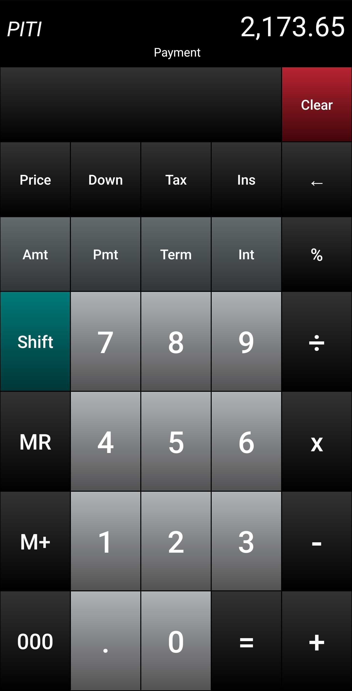
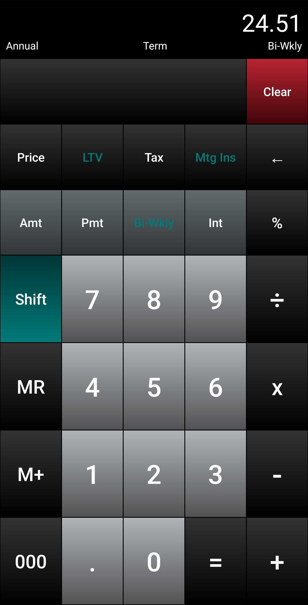

# LoanPro

LoanPro is a fast Android financial calculator for mortgage, auto, credit card, and personal loan scenarios.

Enter any three of loan amount, payment, term, and interest rate, then tap the missing value to solve it. Mortgage-focused views add taxes, insurance, down payment, LTV, PMI, and bi-weekly calculations without adding ads, analytics, tracking, or network access.

<p>
  
  
</p>

The screenshots above are the same F-Droid listing images tracked under `fastlane/metadata/android/en-US/images/phoneScreenshots/`.

## Features

- Calculate payment, loan amount, term, or interest rate.
- Add taxes and insurance for PITI views.
- Calculate price, down payment, loan amount, and LTV.
- View PMI and bi-weekly loan details.
- Use calculator-style entry with percent, decimal, backspace, memory, and clear behavior tuned for repeated calculations.
- Runs fully offline with no network permission.

## Getting Started

LoanPro works around four core values: amount, payment, term, and interest. Enter a value, tap the bucket it belongs to, repeat until three values are stored, then tap the missing bucket to calculate it.

Example payment calculation:

1. Enter `150000`, then tap `Amt`.
2. Enter `30`, then tap `Term`.
3. Enter `4.75`, then tap `Int`.
4. Tap `Pmt` to calculate a monthly payment of `$782.47`.

Example loan amount calculation:

1. Enter `150`, then tap `Pmt`.
2. Enter `3`, then tap `Term`.
3. Enter `7.9`, then tap `Int`.
4. Tap `Amt` to calculate a loan amount of `$4,793.82`.

Example term calculation:

1. Enter `12000`, then tap `Amt`.
2. Enter `200`, then tap `Pmt`.
3. Enter `4.9`, then tap `Int`.
4. Tap `Term` to calculate `5.75` years.
5. Tap `Term` again to view the same result as `68.97` months.

Example interest-rate calculation:

1. Enter `25000`, then tap `Amt`.
2. Enter `500`, then tap `Pmt`.
3. Enter `5`, then tap `Term`.
4. Tap `Int` to calculate `7.42%`.

Hold `Clear` to reset stored values. If the payment is too low to cover interest, LoanPro shows `Pmt Low`; increase the payment, lower the rate, or reduce the amount before solving term.

## Mortgage Extras

- Tap `Pmt` repeatedly after entering tax and insurance to cycle through P+I and PITI views.
- Use `Price` and `Down` to calculate loan amount from purchase price and down payment.
- Tap `Down` again to cycle between percent and dollar views.
- Use `Shift` + `Term` for bi-weekly information, then continue pressing `Term` to cycle through term, interest savings, total interest, total principal, and total P+I.

The full in-app help page lives at `app/src/main/res/raw/quick_start_guide.htm`.

## Project

- Single-module Android app under `:app`.
- Package/application ID: `net.kaltner.LoanPro`.
- Current release: `1.0.2` (`versionCode` `10002`).
- Minimum SDK: 21.
- Target/compile SDK: 36.
- License: Apache-2.0.
- No network permissions, analytics, ads, Play Services, Firebase, or crash-reporting SDKs.

## Build

```bash
ANDROID_HOME=$HOME/Android/Sdk ./gradlew --no-daemon :app:assembleDebug
ANDROID_HOME=$HOME/Android/Sdk ./gradlew --no-daemon testDebugUnitTest
```

Release signing is configured through environment variables when needed:

```bash
export LOANPRO_RELEASE_STORE_FILE=/path/to/keystore.jks
export LOANPRO_RELEASE_STORE_PASSWORD=...
export LOANPRO_RELEASE_KEY_ALIAS=...
export LOANPRO_RELEASE_KEY_PASSWORD=...

ANDROID_HOME=$HOME/Android/Sdk ./gradlew --no-daemon :app:assembleRelease
```

Original signing keys are not included in this repository.

## Store and F-Droid Metadata

Fastlane/F-Droid metadata lives under `fastlane/metadata/android/en-US/`.

- Title: `fastlane/metadata/android/en-US/title.txt`
- Short description: `fastlane/metadata/android/en-US/short_description.txt`
- Full description: `fastlane/metadata/android/en-US/full_description.txt`
- Changelog: `fastlane/metadata/android/en-US/changelogs/`
- Listing icon: `fastlane/metadata/android/en-US/images/icon.png`
- Phone screenshots:
  - `fastlane/metadata/android/en-US/images/phoneScreenshots/1.jpg`
  - `fastlane/metadata/android/en-US/images/phoneScreenshots/2.jpg`

F-Droid consumes those Fastlane image paths during metadata import, so no separate screenshot capture task is pending for the current listing.
